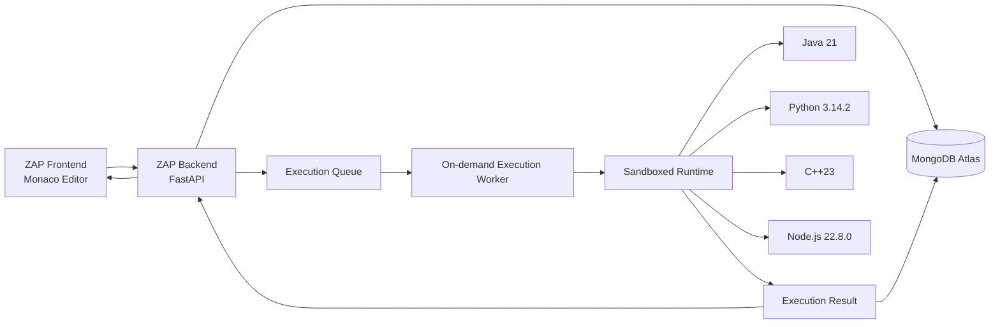
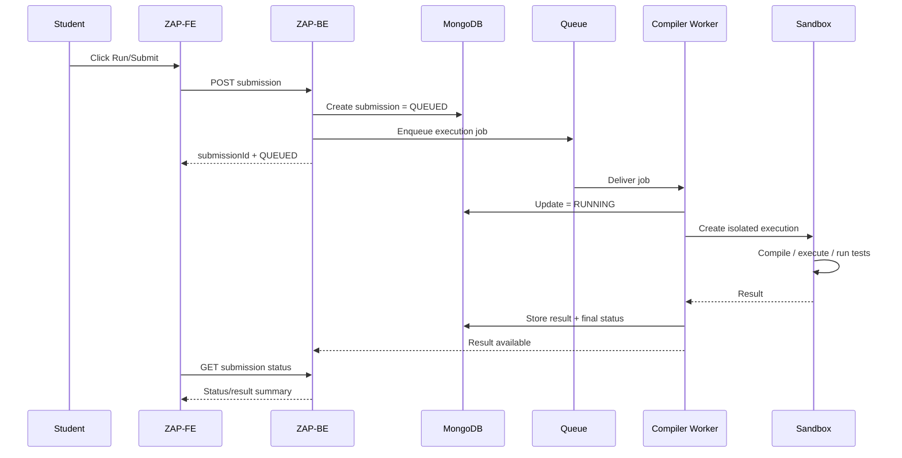

# ZAP — Compiler / Online Judge Architecture

This document describes **only the compiler/execution subsystem**.

The compiler must remain independent of the question content. Questions provide test cases and execution policy; the compiler executes code against those inputs.

---

# 1. Goal

Build a reliable online code execution service for:

- Java 21
- Python 3.14.2
- C++23
- Node.js 22.8.0

The first practical target is:

- 0 → ~1,000 student users/day
- bursty sessions
- possible 200–500 simultaneous students during tests/content sessions
- all required test cases executed per submission
- low idle cost
- managed infrastructure
- no Kubernetes initially

---

# 2. High-level architecture



### Responsibilities

| Component | Responsibility |
|---|---|
| Frontend | Editor, language selection, test input, display result |
| FastAPI | Authentication, validation, submission creation, status APIs |
| MongoDB | Question/test-case data and submission records |
| Queue | Buffer bursty execution demand |
| Execution worker | Receive one execution job and run it |
| Sandbox | Restrict the submitted program |
| Runtime | Compile/interpret and execute the student's program |

---

# 3. The most important boundary

Never do this:

```text
FastAPI process
   ↓
run(student_code)
```

Do this:

```text
FastAPI
   ↓
Execution job
   ↓
Worker
   ↓
Sandbox
   ↓
Student process
```

The API server should remain responsive even while compilers are busy.

---

# 4. What is an on-demand compiler worker?

An execution worker is a temporary compute environment used to process a submission.

Conceptually:

```text
submission
   ↓
start/assign worker
   ↓
load language runtime
   ↓
compile if required
   ↓
run tests
   ↓
collect result
   ↓
release worker
```

The worker is not a permanent server dedicated to one student.

Cloud Run can start additional instances when demand increases and scale instances down when demand decreases. Configure a maximum instance limit for cost control.

---

# 5. What is the sandbox?

The sandbox is the security/resource boundary around the student's program.

Example logical limits:

```text
Sandbox
├── CPU limit
├── Memory limit
├── Wall-clock timeout
├── Process/PID limit
├── Output limit
├── File-size limit
├── Ephemeral filesystem
├── Network: disabled
├── Non-root user
└── No host/application secret access
```

The exact numbers should be configurable per question.

Example starting policy (not a final product requirement):

```text
CPU             1 vCPU
Memory          256–512 MB
Wall time       2–5 seconds for normal DSA problems
Compile time    separate limit
Output          small bounded limit
Network         disabled
```

Do not hard-code these values in the worker source. Store execution policy in configuration and/or the question document.

---

# 6. Why queueing is required

A test session may create a sudden burst:

```text
300 students
 ×
multiple submissions
 ×
multiple hidden tests
```

The API should not try to execute everything immediately in the request handler.

Instead:

```text
100s/1000s of submissions
          ↓
       Queue
          ↓
  available execution workers
```

The queue absorbs spikes and protects the database/API layer from execution pressure.

### Queue technology

A managed Redis service can be used for the initial queue/cache design.

Redis Streams support consumer groups and acknowledgement, which are useful for worker-style processing.

If a later implementation chooses a cloud-native task queue (such as Google Cloud Tasks/Pub/Sub or another managed HTTP queue), keep the submission API contract unchanged.

---

# 7. Submission lifecycle



Polling is acceptable for the first implementation. WebSocket/SSE can be introduced later if the UX needs live streaming.

---

# 8. Run flow

Typical use:

```text
Student writes code
      ↓
Choose language
      ↓
Choose public/custom test input
      ↓
Run
      ↓
Compile
      ↓
Execute
      ↓
Return stdout/stderr/status
```

Run is for fast development feedback.

It should not reveal hidden test cases.

---

# 9. Submit flow

```text
Student clicks Submit
       ↓
Validate question + language
       ↓
Create submission
       ↓
Queue job
       ↓
Worker receives job
       ↓
Compile once where applicable
       ↓
Run required test suite
       ↓
Compare output
       ↓
Generate verdict
       ↓
Store result
       ↓
Show student summary
```

For example:

```text
Compilation       PASS
Public tests      5/5
Hidden tests      PASS
Final verdict     ACCEPTED
```

or:

```text
Compilation       PASS
Tests passed      7/10
Final verdict     WRONG_ANSWER
```

Do not reveal which hidden input caused the failure unless product policy explicitly allows a safe diagnostic.

---

# 10. Language execution model

## Python

```text
main.py
   ↓
python 3.14.2 main.py
```

## Node.js

```text
main.js
   ↓
node 22.8.0 main.js
```

## C++

```text
main.cpp
   ↓
g++/clang++ -std=c++23
   ↓
executable
   ↓
run executable
```

## Java

```text
Main.java
   ↓
javac
   ↓
.class files
   ↓
java Main
```

The exact source-file/class-name conventions must be documented in the editor/runner contract.

---

# 11. Compiler image strategy

Use one immutable runtime image per supported language, or one carefully designed worker image with the required toolchains.

Preferred starting structure:

```text
executor/
├── java21/
│   └── Dockerfile
├── python314/
│   └── Dockerfile
├── cpp23/
│   └── Dockerfile
└── node2208/
    └── Dockerfile
```

Build images in CI and deploy them to the execution platform.

Pin versions so the same submission behaves consistently over time.

---

# 12. Concurrency strategy

For the first secure implementation, prefer:

```text
1 submission
   ↓
1 isolated execution slot
   ↓
1 worker instance
```

This makes resource accounting and isolation simpler.

Later, controlled concurrency can be introduced after benchmarking and security review.

Do not allow multiple untrusted student programs to share the same execution filesystem or process namespace.

---

# 13. Scaling model

Suppose a test creates a burst:

```text
students
  ↓
submissions
  ↓
queue
  ↓
worker instances
```

Worker count should be based on:

```text
peak execution demand
÷
execution capacity per worker
```

Not simply:

```text
number of registered users
```

Example concept:

```text
Idle
0 workers

Small activity
2–5 workers

Peak test
50–200+ workers, subject to configured limits/capacity

After test
workers scale down
```

The exact capacity must be determined by benchmark tests using real ZAP questions.

---

# 14. Failure handling

Every execution job must have a bounded lifecycle.

Possible failures:

```text
QUEUE_TIMEOUT
COMPILATION_ERROR
RUNTIME_ERROR
TIME_LIMIT_EXCEEDED
MEMORY_LIMIT_EXCEEDED
OUTPUT_LIMIT_EXCEEDED
SANDBOX_ERROR
WORKER_ERROR
SYSTEM_ERROR
CANCELLED
```

Worker rules:

- always enforce timeout
- always clean temporary files
- never leave a job permanently RUNNING
- retry only infrastructure failures
- do not retry deterministic compile errors
- make job processing idempotent using `submissionId`

---

# 15. Cost control

Cloud Run should be configured so the compiler does not remain fully provisioned during idle periods.

Controls:

- scale-to-zero where supported by the final trigger architecture
- maximum instance count
- bounded concurrency
- CPU/memory limits
- queue backlog monitoring
- per-user rate limits
- execution quotas
- budget alerts

Do not increase maximum instances without checking MongoDB and queue capacity.

---

# 16. Security checklist

### Student code

- [ ] runs as non-root
- [ ] network disabled
- [ ] no application credentials exposed
- [ ] no metadata service access
- [ ] no host mount
- [ ] no privileged mode
- [ ] limited CPU
- [ ] limited memory
- [ ] limited PIDs/processes
- [ ] limited filesystem space
- [ ] limited output
- [ ] strict timeout
- [ ] temporary filesystem cleaned after execution

### Question data

- [ ] hidden test cases never returned to browser
- [ ] hidden reference solutions never returned to browser
- [ ] worker credentials cannot be used as application credentials
- [ ] faculty/admin APIs require authorization

### Sandbox technology

The exact sandbox mechanism must be validated before production because arbitrary code execution is a security-sensitive workload. If standard container isolation is not sufficient for the threat model, use an additional isolation technology or a specialized judge/sandbox service.

---

# 17. Observability

Track at minimum:

```text
submission_rate
queue_depth
queue_wait_ms
compile_time_ms
execution_time_ms
worker_start_latency
worker_failures
sandbox_failures
accepted_count
wrong_answer_count
compile_error_count
timeout_count
memory_limit_count
```

Every execution log should include a correlation identifier such as:

```text
submissionId
questionId
workerId/instance ID
language
```

Never log full hidden test contents or sensitive source code unnecessarily.

---

# 18. Compiler API boundary

The frontend should never need to know how the worker is implemented.

Conceptually:

```http
POST /api/v1/submissions
```

```json
{
  "questionId": "two-sum",
  "language": "python",
  "mode": "SUBMIT",
  "sourceCode": "..."
}
```

Response:

```json
{
  "submissionId": "sub_12345",
  "status": "QUEUED"
}
```

Status:

```http
GET /api/v1/submissions/sub_12345
```

Example response:

```json
{
  "submissionId": "sub_12345",
  "status": "ACCEPTED",
  "verdict": "ACCEPTED",
  "executionTimeMs": 143,
  "memoryUsedBytes": 28180480
}
```

This interface is the key loose-coupling boundary between the product and the compiler.

---

# 19. Compiler subsystem rule

A future question, course, mock interview, or assessment must be able to reuse the same compiler service.

The compiler should not contain logic such as:

```text
if question == "two-sum": ...
if course == "arrays": ...
```

All question-specific information must come through the execution request/test-case contract.

