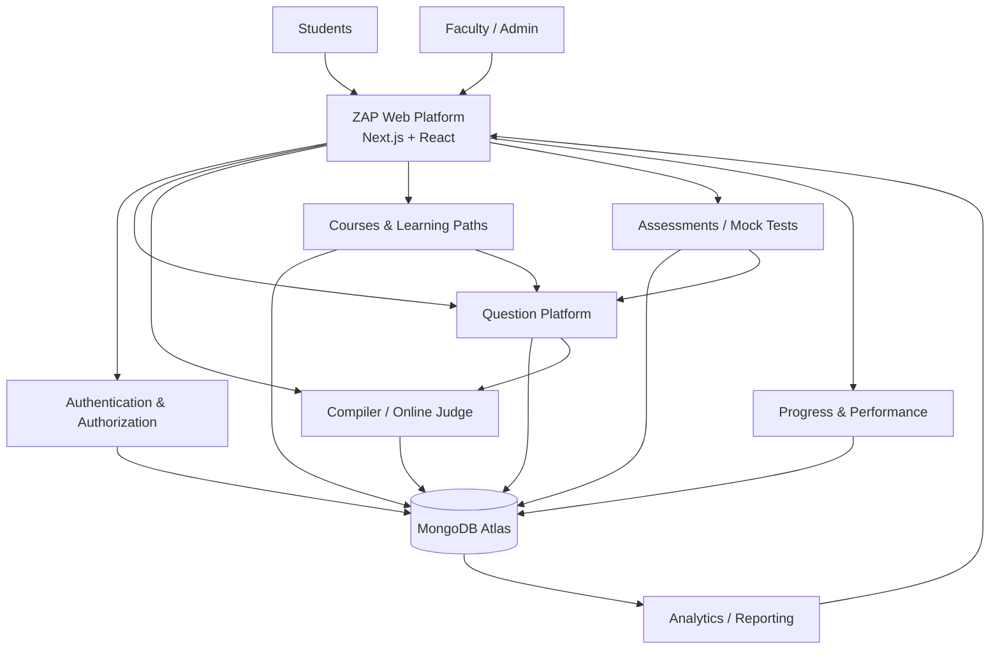

# ZAP — Future Platform Architecture

The initial product is the coding/compiler platform, but the architecture should support a larger ZAP learning platform later.

The most important design decision is to keep **questions reusable**.

A question should not belong permanently to a single course.

---

# 1. Future platform diagram



---

# 2. Reusable question platform

The central question system becomes the common building block for:

```text
DSA practice
Courses
Assignments
Mock interviews
Timed assessments
Faculty-created tests
Future coding challenges
```

A course can reference questions.

An assessment can reference questions.

A mock interview can reference questions.

The compiler only needs the question/test-case execution contract.

---

# 3. Future course platform

Possible future structure:

```text
Course
 ├── modules
 │    ├── topics
 │    │    ├── lessons
 │    │    └── questions[]
 │    └── assessments[]
 ├── faculty
 └── metadata
```

Questions remain reusable assets.

Example:

```text
Question: Two Sum
       │
       ├── DSA Course / Arrays
       ├── Mock Interview / Beginner
       ├── Assessment / Week 2
       └── Practice Set / Hash Map
```

---

# 4. Future user capabilities

### Student

- profile
- solved questions
- submission history
- progress
- course enrollment
- assessments
- performance analytics
- bookmarks/favourites

### Faculty

- question management
- course creation
- assignments
- assessments
- student performance
- batch/group management
- reusable question sets

### Admin

- users/faculty management
- platform configuration
- reporting
- audit logs
- permissions

---

# 5. Future services

Do not implement these as independent microservices on day one.

Introduce boundaries in the code first; split into services only when scale/team/domain complexity justifies it.

Possible future logical modules:

```text
Identity
Question
Course
Assessment
Compiler
Submission
Progress
Notification
Analytics
Billing (if required later)
```

---

# 6. Future scale

The expected long-term user base may grow toward roughly 20,000 users over five years, with hundreds of faculty.

The platform should therefore prioritize:

- stateless API design
- managed database
- indexed queries
- asynchronous execution
- reusable question model
- independent compiler scaling
- clear authorization boundaries
- observability
- automated deployment

This scale does not justify premature Kubernetes/microservice complexity.

---

# 7. Future analytics

A future analytics layer can consume submission/application events to provide:

```text
student progress
question difficulty validation
common failed topics
language usage
assessment performance
faculty/course performance
```

Avoid embedding analytics-only logic into the compiler execution path.

The compiler should emit structured execution/submission results and remain focused on execution.

---

# 8. Future architecture principle

Build the first version as a **modular monolith + isolated execution service**.

That means:

```text
ZAP application
├── auth
├── users
├── questions
├── faculty
├── submissions
├── courses (future)
├── assessments (future)
└── progress (future)

Separate execution boundary
└── compiler/sandbox workers
```

This gives the simplicity of one backend codebase while keeping the dangerous, CPU-heavy compiler workload isolated.

