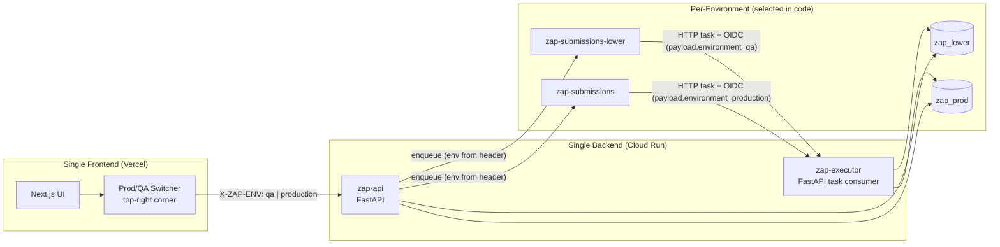

# Handoff — Issue-010: Single Deployment Pipeline with Runtime Prod/QA Environment Switcher

**Date:** 2026-10-04
**Author:** GitHub Copilot (session handoff)
**Status:** 📋 PLANNED — implementation to be executed by a separate (low-tier) model from GitHub issue #10

---

## 1. Goal

Replace the two-branch / two-deployer QA+production pipeline (issue #9) with a **single, simple deployment model**:

- **ONE branch** (`main`), **ONE CI/CD pipeline**, **ONE deployer service account**, **ONE WIF provider**.
- **ONE API Cloud Run service** (`zap-api`) and **ONE executor Cloud Run service** (`zap-executor`).
- **ONE frontend deployment** (Vercel) with a **Prod/QA switcher in the top-right corner** of the UI.
- Only the **MongoDB database name** and **Cloud Tasks queue name** differ per environment:
  - QA: `zap_lower` / `zap-submissions-lower`
  - Production: `zap_prod` / `zap-submissions`
- Environment is selected **at runtime in code** — no separate QA deployment process, no QA IAM, no conditional bindings.

---

## 2. Why (Problem with Issue #9)

Issue #9 created separate QA/production Cloud Run services, deployer SAs, WIF providers, and conditional IAM bindings. QA deployment was blocked because the **conditional** `run.admin` binding on the QA deployer did not match (`Permission 'run.services.get' denied`). The two-branch model also duplicated the entire deployment surface for a single small difference (DB name + queue name).

**Decision:** Keep the code mostly unchanged. Only DB + queue are per-environment. Everything else is shared and selected in code.

---

## 3. New Architecture



**Flow:**
1. User toggles **Prod/QA** in the top-right corner of the UI. Selection is persisted in `localStorage`.
2. Every API call from the frontend includes the header `X-ZAP-ENV: qa|production`.
3. The single API service reads the header and selects the DB (`zap_lower`/`zap_prod`) and Cloud Tasks queue (`zap-submissions-lower`/`zap-submissions`).
4. The enqueued Cloud Task payload includes `"environment": "qa"|"production"`.
5. The single executor service reads `environment` from the task payload and selects the DB for loading/persisting the submission.

---

## 4. Design Decisions

1. **Single deploy job** — remove `deploy-qa`; rename `deploy-production` → `deploy`; trigger on push to `main` + `workflow_dispatch` only.
2. **Single WIF provider** (`zap-repository`) and **single deployer SA** (`zap-github-deployer`) — no QA deployer, no conditional IAM.
3. **Per-environment config is just 2 values**: `DATABASE_NAME` + `QUEUE_NAME`. Everything else (executor URL, OIDC audience, task-caller SA, CORS) is shared because there is only one API and one executor.
4. **Environment flows through the request**: frontend header `X-ZAP-ENV` → API dependency → DB + queue; task payload `environment` → executor → DB.
5. **Single task-caller SA** (`zap-tasks-invoker`) for both queues — the executor verifies OIDC against the shared audience/SA. (`zap-tasks-invoker-qa` becomes unused; see cleanup.)
6. **CORS**: single frontend origin + `http://localhost:3000` (both envs share the same frontend deployment).
7. **Health endpoint** returns the default environment (`production`); the CI verify step only asserts `status == "healthy"` (no per-env assertion).

---

## 5. Detailed Changes

### 5.1 Backend — `ZAP-BE`

#### 5.1.1 `app/config.py` — per-environment settings

Add a small config model + helper. Replace the single `DATABASE_NAME` / `TASKS_QUEUE_NAME` settings with per-env values:

```python
from pydantic import BaseModel

class EnvironmentConfig(BaseModel):
    database_name: str
    queue_name: str

class Settings(BaseSettings):
    APP_NAME: str = "ZAP Backend API"
    ENVIRONMENT: str = "development"          # default env label for /health
    DEBUG: bool = True
    MONGODB_URI: str = "mongodb://localhost:27017"
    CORS_ORIGINS: list[str] = ["http://localhost:3000", "https://codezap-arena.vercel.app"]
    CORS_ORIGIN_REGEX: str | None = None

    # Shared Cloud Tasks / executor config (single API + single executor)
    GCP_PROJECT_ID: str = ""
    GCP_LOCATION: str = "us-central1"
    EXECUTOR_TASK_URL: str = "http://localhost:8080/internal/tasks/execute"
    TASKS_OIDC_AUDIENCE: str = "http://localhost:8080"
    TASKS_SERVICE_ACCOUNT: str = ""
    TASKS_EXECUTION_LEASE_SECONDS: int = 360

    # Per-environment (only DB name + queue name differ)
    DEFAULT_ENVIRONMENT: str = "production"
    QA_DATABASE_NAME: str = "zap_lower"
    QA_QUEUE_NAME: str = "zap-submissions-lower"
    PRODUCTION_DATABASE_NAME: str = "zap_prod"
    PRODUCTION_QUEUE_NAME: str = "zap-submissions"

    model_config = SettingsConfigDict(env_file=".env", extra="allow")

    def get_environment_config(self, env: str) -> EnvironmentConfig:
        if env == "qa":
            return EnvironmentConfig(database_name=self.QA_DATABASE_NAME, queue_name=self.QA_QUEUE_NAME)
        return EnvironmentConfig(database_name=self.PRODUCTION_DATABASE_NAME, queue_name=self.PRODUCTION_QUEUE_NAME)
```

> Remove the old `DATABASE_NAME` and `TASKS_QUEUE_NAME` fields and update all references (see below).

#### 5.1.2 `app/db/mongodb.py` — per-environment database

- Cache one client/db **per environment name** instead of a single global db.
- `get_database_for_env(env: str)` — returns the db for the env (remote Mongo or mongomock fallback).
- `get_database(request: Request)` — FastAPI dependency; reads `X-ZAP-ENV` header (default `DEFAULT_ENVIRONMENT`), delegates to `get_database_for_env`.
- Update `set_test_database(mock_db, env=None)` so tests can set the db for a specific env (defaults to `DEFAULT_ENVIRONMENT`).

```python
from fastapi import Request
from app.config import get_settings

class DatabaseManager:
    clients: dict[str, Any] = {}
    dbs: dict[str, Any] = {}

db_manager = DatabaseManager()

def get_request_environment(request: Request | None = None) -> str:
    settings = get_settings()
    if request is None:
        return settings.DEFAULT_ENVIRONMENT
    return request.headers.get("X-ZAP-ENV", settings.DEFAULT_ENVIRONMENT)

def get_database_for_env(env: str):
    if env in db_manager.dbs:
        return db_manager.dbs[env]
    settings = get_settings()
    env_cfg = settings.get_environment_config(env)
    if settings.MONGODB_URI.startswith(("mongodb://", "mongodb+srv://")) and not settings.MONGODB_URI.startswith(
        ("mongodb://localhost", "mongodb://127.0.0.1")
    ):
        from pymongo import MongoClient
        client = MongoClient(settings.MONGODB_URI, serverSelectionTimeoutMS=5000)
        client.admin.command("ping")
        db_manager.clients[env] = client
        db_manager.dbs[env] = client[env_cfg.database_name]
        return db_manager.dbs[env]
    try:
        import mongomock
        mock_client = mongomock.MongoClient()
        db_manager.clients[env] = mock_client
        db_manager.dbs[env] = mock_client[env_cfg.database_name]
        return db_manager.dbs[env]
    except Exception:
        return None

def get_database(request: Request = None):
    return get_database_for_env(get_request_environment(request))

def set_test_database(mock_db: Any, env: str | None = None):
    env = env or get_settings().DEFAULT_ENVIRONMENT
    if db_manager.clients.get(env) is not None and mock_db is None:
        close = getattr(db_manager.clients[env], "close", None)
        if close:
            close()
        db_manager.clients.pop(env, None)
    db_manager.dbs[env] = mock_db
```

#### 5.1.3 `app/submissions/queue.py` — per-environment queue

- `CloudTasksQueue.__init__(self, settings=None, environment="production")` — store `self.environment`.
- `enqueue()` — add `"environment": self.environment` to the task payload dict.
- `get_queue_for_env(env: str)` — returns `CloudTasksQueue(settings, env)` when `GCP_PROJECT_ID` is set, else `MemorySubmissionQueue()`.
- `get_queue(request: Request = None)` — FastAPI dependency; reads header, delegates to `get_queue_for_env`.
- Keep the module-level cache keyed by env (e.g. `_queue_instances: dict[str, ...]`).

#### 5.1.4 `app/submissions/service.py` — thread environment through

- `SubmissionService.__init__(self, db, queue=None, environment="production")` — `self.queue = queue if queue is not None else get_queue_for_env(environment)`.
- `create_submission()` — enqueue payload includes `"environment": self.environment`.

#### 5.1.5 `app/submissions/router.py` — env-scoped service dependency

```python
def get_submission_service(request: Request, db=Depends(get_database)) -> SubmissionService:
    env = get_request_environment(request)
    return SubmissionService(db, get_queue_for_env(env), env)
```

#### 5.1.6 `executor/tasks/handler.py` — environment from task payload

- `TaskPayload` gains `environment: str = "production"`.
- Remove the `get_submission_service` dependency; build the service inside `execute_task`:

```python
@router.post("/execute")
def execute_task(request: Request, payload: TaskPayload):
    verify_cloud_tasks(request)
    env = payload.environment
    db = get_database_for_env(env)
    service = SubmissionService(db, get_queue_for_env(env), env)
    ...
```

- `_run_judge(submission_id, submission, environment)` — use `get_database_for_env(environment)` for the `QuestionService`.
- `verify_cloud_tasks` stays unchanged (audience + SA are shared across envs).

### 5.2 Frontend — `ZAP-FE`

#### 5.2.1 New `src/services/environment.ts`

```ts
export type ZAPEnvironment = "qa" | "production";
export const ENVIRONMENT_HEADER = "X-ZAP-ENV";
const STORAGE_KEY = "zap.environment";

export function getEnvironment(): ZAPEnvironment {
  const stored = typeof localStorage !== "undefined" ? localStorage.getItem(STORAGE_KEY) : null;
  return stored === "qa" ? "qa" : "production";
}

export function setEnvironment(env: ZAPEnvironment): void {
  if (typeof localStorage !== "undefined") localStorage.setItem(STORAGE_KEY, env);
}
```

#### 5.2.2 `src/services/questionsApi.ts` + `src/services/submissionsApi.ts`

- In `apiFetch`, read the env **per request** (not at module load) and add the header:

```ts
import { getEnvironment, ENVIRONMENT_HEADER } from "./environment";
// inside apiFetch:
const res = await fetch(`${API_BASE}${path}`, {
  headers: {
    "Content-Type": "application/json",
    [ENVIRONMENT_HEADER]: getEnvironment(),
    ...init?.headers,
  },
  ...init,
});
```

#### 5.2.3 New `src/components/EnvironmentSwitcher.tsx`

- `"use client"` segmented control: **Prod | QA**.
- Shows active env with a colored badge (green = production, amber = QA).
- On change: `setEnvironment(env)` and re-render (state via `useState` initialized from `getEnvironment()`).
- Place in the **top-right corner** of every header.

#### 5.2.4 Add the switcher to headers

- `src/components/StudentWorkspace.tsx` — header right side (next to Faculty Portal link).
- `src/app/faculty/questions/page.tsx` — header right side.
- `src/app/faculty/questions/new/page.tsx` — header right side.

### 5.3 CI/CD — `.github/workflows/ci.yml`

1. Triggers: `push: branches: [main]`, `pull_request: branches: [main]`, `workflow_dispatch`. Remove `qa`.
2. Delete the entire `deploy-qa` job.
3. Rename `deploy-production` → `deploy`; `if: github.ref == 'refs/heads/main' && (github.event_name == 'push' || github.event_name == 'workflow_dispatch')`.
4. Single WIF provider: `projects/394729648143/locations/global/workloadIdentityPools/github-actions/providers/zap-repository`; single SA: `zap-github-deployer@zap-platform-prod.iam.gserviceaccount.com`.
5. Deploy `zap-api` and `zap-executor` with **both** envs' env vars:

```
ENVIRONMENT=production,DEBUG=false,
GCP_PROJECT_ID=zap-platform-prod,GCP_LOCATION=us-central1,
EXECUTOR_TASK_URL=https://zap-executor-394729648143.us-central1.run.app/internal/tasks/execute,
TASKS_OIDC_AUDIENCE=https://zap-executor-394729648143.us-central1.run.app,
TASKS_SERVICE_ACCOUNT=zap-tasks-invoker@zap-platform-prod.iam.gserviceaccount.com,
QA_DATABASE_NAME=zap_lower,QA_QUEUE_NAME=zap-submissions-lower,
PRODUCTION_DATABASE_NAME=zap_prod,PRODUCTION_QUEUE_NAME=zap-submissions,
CORS_ORIGINS=["http://localhost:3000","https://codezap-arena.vercel.app"],CORS_ORIGIN_REGEX=
```

   (API only — executor does not need CORS vars. Both get `MONGODB_URI` secret.)
6. IAM steps (idempotent, single deployer):
   - API runtime SA (`zap-api-runtime`) → `roles/cloudtasks.enqueuer` on **both** `zap-submissions` and `zap-submissions-lower`.
   - Task SA (`zap-tasks-invoker`) → `roles/iam.serviceAccountTokenCreator` (self) + `roles/iam.serviceAccountUser` for API runtime SA.
   - Executor service → `roles/run.invoker` for task SA.
7. Verify step: `curl /health`, assert `status == "healthy"` only (drop the `environment == "qa"` assertion).

### 5.4 Docs

- `docs/07-ZAP-PRODUCTION-AND-CLOUD-SETUP-GUIDE.md` — replace the two-branch model (sections 4.5, identity table, Vercel env var notes) with the single-pipeline model + `X-ZAP-ENV` design.
- `docs/HANDOFF-issue-009-qa-prod-environments.md` — mark as **SUPERSEDED** by issue #10 (or archive).
- `docs/README.md` — add the new handoff doc to the list.

### 5.5 Tests

- Update `ZAP-BE/tests/test_submissions.py` and `test_executor_tasks.py` for the new `db_manager.dbs` structure and `set_test_database(mock_db, env=...)` signature.
- New `ZAP-BE/tests/test_environment_config.py`:
  - `get_environment_config("qa")` → `zap_lower` / `zap-submissions-lower`.
  - `get_environment_config("production")` → `zap_prod` / `zap-submissions`.
  - `get_environment_config("unknown")` → defaults to production.
- New test: POST `/api/v1/submissions` with `X-ZAP-ENV: qa` header → task payload contains `environment == "qa"` and the QA queue is used.
- Executor test: task payload `{"submissionId": ..., "environment": "qa"}` → submission read from the QA db.

---

## 6. Acceptance Criteria

- [ ] Single `main` branch pipeline; no `qa` branch, no `deploy-qa` job, no QA deployer/WIF provider usage.
- [ ] One API + one executor Cloud Run service; both envs' config deployed as env vars.
- [ ] Frontend has a Prod/QA switcher in the top-right corner; selection persists in `localStorage`; all API calls send `X-ZAP-ENV`.
- [ ] QA submissions use `zap_lower` + `zap-submissions-lower`; production uses `zap_prod` + `zap-submissions`.
- [ ] Executor processes tasks from both queues, selecting the DB from `payload.environment`.
- [ ] Backend tests pass (including new env-selection tests); frontend build passes.
- [ ] `docs/07` updated; issue-009 handoff marked superseded.

---

## 7. Implementation Order (for the implementing model)

1. Backend: `app/config.py` env config + helper.
2. Backend: `app/db/mongodb.py` per-env DB.
3. Backend: `app/submissions/queue.py` per-env queue.
4. Backend: `app/submissions/service.py` + `router.py` env threading.
5. Backend: `executor/tasks/handler.py` env from payload.
6. Backend: update + add tests; run `pytest -v`.
7. Frontend: `environment.ts` + API client headers.
8. Frontend: `EnvironmentSwitcher.tsx` + header integration in 3 files.
9. CI: rewrite `.github/workflows/ci.yml` (single deploy job).
10. Docs: update `docs/07`, mark issue-009 handoff superseded.
11. Run `.agents/skills/build-issue/scripts/verify_build.sh`.

---

## 8. Verification & Useful Commands

```bash
# Backend tests
cd ZAP-BE && pytest -v

# Frontend build + test
npm run build --workspace=ZAP-FE
npm test --workspace=ZAP-FE

# Full verification
.agents/skills/build-issue/scripts/verify_build.sh

# Manual smoke test (after deploy)
curl -s https://zap-api-394729648143.us-central1.run.app/health
# Expect: {"status":"healthy","service":"ZAP-BE","environment":"production"}

# Toggle QA in the UI, then:
curl -s -H "X-ZAP-ENV: qa" https://zap-api-394729648143.us-central1.run.app/health
```

---

## 9. Cleanup (manual, after the new pipeline is verified)

- Git: delete `origin/qa` branch and stale feature branches (`feature/issue-009-qa-prod-environments`, `feature/issue-008-cloud-tasks-queue`, `feature/github-actions-cloud-run-deploy`, `feature/deployment-readiness`).
- GCP (optional, reduces surface): delete `zap-api-qa`, `zap-executor-qa` Cloud Run services; `zap-github-qa-deployer` SA; `zap-qa` WIF provider; `zap-mongodb-uri-qa` secret; `zap-tasks-invoker-qa` SA (only after confirming the single `zap-tasks-invoker` works for both queues).

---

## 10. Environment Reference (single deployment)

| Var | Value (shared) |
|---|---|
| API service | `zap-api` |
| Executor service | `zap-executor` |
| API URL | `https://zap-api-394729648143.us-central1.run.app` |
| Executor URL | `https://zap-executor-394729648143.us-central1.run.app` |
| WIF provider | `zap-repository` |
| Deployer SA | `zap-github-deployer@zap-platform-prod.iam.gserviceaccount.com` |
| Task SA | `zap-tasks-invoker@zap-platform-prod.iam.gserviceaccount.com` |
| API runtime SA | `zap-api-runtime@zap-platform-prod.iam.gserviceaccount.com` |
| Executor runtime SA | `zap-executor-runtime@zap-platform-prod.iam.gserviceaccount.com` |
| MongoDB secret | `zap-mongodb-uri` |
| CORS | `http://localhost:3000`, `https://codezap-arena.vercel.app` |

| Per-env | QA | Production |
|---|---|---|
| `DATABASE_NAME` | `zap_lower` | `zap_prod` |
| `QUEUE_NAME` | `zap-submissions-lower` | `zap-submissions` |
| Frontend header | `X-ZAP-ENV: qa` | `X-ZAP-ENV: production` |
| Task payload field | `"environment": "qa"` | `"environment": "production"` |